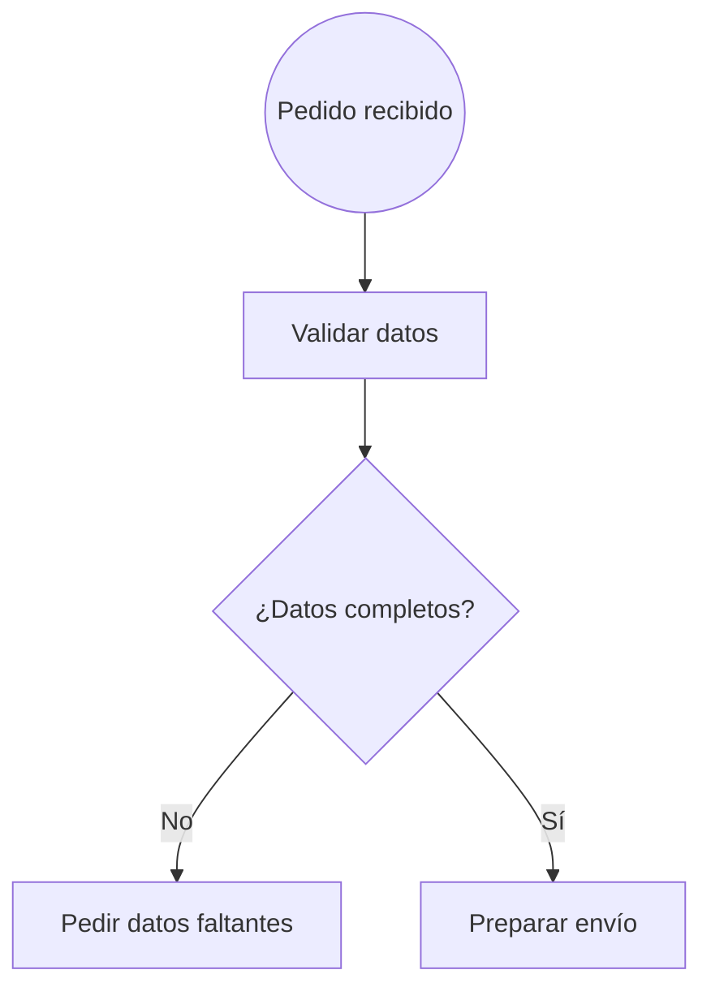

# Diagram Maker

Genera diagramas de flujo a partir de código con sintaxis de **Mermaid (flowchart)** y los muestra en
una página HTML autocontenida, con un motor de layout propio: rejilla ordenada, solo líneas rectas y
sin cruces, y posiciones controlables con metadatos en comentarios.



Este es el propio proyecto, dibujado con él ([`examples/proyecto.mmd`](examples/proyecto.mmd)): cada
`subgraph` se dibuja como un diagrama aparte y las flechas entre ellos usan nodos de referencia
(paralelogramos discontinuos).


Mermaid se usa solo como **sintaxis** (la conocen bien los modelos de IA y el archivo sigue siendo
compatible con Mermaid); el dibujo lo hace este proyecto.

## Instalación

Requisitos: [Node.js](https://nodejs.org) 18 o superior.

```sh
npm install -g @jesjack/diagram-maker
```

O desde el código:

```sh
git clone https://github.com/jesjack/diagram_maker.git
cd diagram_maker
npm install -g .      # instala el comando dmk (o `npm link` para desarrollar)
```

En Android funciona en **Termux** (`pkg install nodejs`).

## Uso

```sh
dmk archivo.mmd                 # genera archivo.html junto al .mmd y lo abre en el navegador
dmk archivo.mmd --watch         # recarga en vivo: la página se actualiza al guardar el .mmd
dmk archivo.mmd --svg           # exporta archivo.svg, sin abrir nada
dmk archivo.mmd --png           # exporta archivo.png (--escala 3 para más resolución)
dmk archivo.mmd --html          # solo genera el HTML
dmk notas.md                    # cada bloque ```mermaid del .md (notas.html, o notas-1.html, notas-2.html…)
dmk carpeta/ --svg              # todos los .mmd y .md de la carpeta (sin entrar en subcarpetas)
dmk archivo.mmd --servidor      # abre la página sirviéndola desde 127.0.0.1 (navegadores en sandbox)
dmk archivo.mmd --ligero        # HTML sin Mermaid incrustado (más pequeño, sin botón «Mermaid»)
dmk archivo.mmd --tema oscuro   # tema oscuro (visor, SVG y PNG); el visor sigue al sistema y su botón ◐ lo cambia
dmk a.mmd b.mmd --svg           # varios archivos: cada resultado junto a su .mmd
dmk *.mmd --comprobar           # valida sin dibujar: errores, avisos y tamaño de cada diagrama
dmk                             # escribe el diagrama en la terminal (termina con Ctrl+D)
cat archivo.mmd | dmk --svg -o diagrama.svg
```

También se puede escribir el diagrama en el propio comando, sin crear un archivo:

```sh
dmk --png -o pedido.png <<'EOF'
flowchart TD
    a["Pedido"] --> b{"¿Hay stock?"}
    b -->|sí| c(["Enviar"])
    b -->|no| d(["Avisar"])
EOF
```

Pon `'EOF'` entre comillas para que la terminal no toque el texto (`$`, `` ` ``, `\`). Sin `--svg`,
`--png` ni `-o`, el diagrama se guarda en la carpeta temporal y se abre en el navegador.

`dmk --ayuda` muestra todas las opciones.

- **HTML**: es un único archivo con parser, layout y visor incrustados; se puede abrir o compartir
  sin nada más. `dmk` abre el archivo guardado directamente en el navegador. En **Termux** el
  navegador no puede leer los archivos de Termux: el HTML se copia a `Download/dmk/` y se abre desde
  ahí (`DMK_CARPETA` cambia la carpeta); sin acceso al almacenamiento (`termux-setup-storage`) se
  usa el servidor. Los navegadores en
  sandbox (flatpak, snap) no suelen poder abrir cualquier carpeta: con `--servidor`, `dmk` levanta
  un mini servidor en `127.0.0.1` que sirve la página una vez.
- **Markdown y carpetas**: de un `.md` se dibuja cada bloque ```` ```mermaid ```` (o `~~~mermaid`);
  con uno solo el resultado se llama como el `.md`, con varios se numeran (`notas-1.html`…). Una
  carpeta aporta sus `.mmd` y los `.md` que tengan bloques, sin entrar en subcarpetas. Con varios
  diagramas solo se generan, sin abrir nada.
- **`--watch`**: el servidor se queda abierto (Ctrl+C para salir) y vigila el `.mmd`; al guardarlo,
  la página se redibuja sola conservando el zoom y la posición. Si el código tiene un error se
  muestra el panel de error y se sigue vigilando.
- **SVG y PNG**: se generan sin navegador, con el mismo motor. El texto se mide y se pinta con la
  fuente DejaVu Sans (incluida como dependencia), así que los nodos tienen el tamaño justo.

`diagram.py` es la versión anterior del comando, en Python y sin dependencias (`python3 diagram.py
archivo.mmd`, con `--watch` y `--no-open`); no exporta a SVG/PNG.

## El visor

- **Ratón**: rueda para el zoom, arrastrar para moverse, doble clic para ajustar. Teclado: `+`, `-`, `0`.
- **Táctil**: un dedo arrastra, dos dedos hacen zoom, doble toque ajusta.
- **Pastillas de id**: cada nodo lleva su id en una esquina. Tocar la pastilla de un empalme
  (`● A8`) lleva con una animación hasta ese nodo.
- **Paso a paso** (◀ ▶ arriba a la izquierda, o ← →): muestra cómo se construyó el diagrama, nodo a
  nodo, tal como estaba en cada paso y con el motivo de cada colocación. Sirve para entender o
  depurar el layout.
- **SVG / PNG**: descarga el diagrama.
- **Mermaid**: abre el mismo código dibujado con Mermaid oficial en otra pestaña, para comparar.
  Mermaid va incrustado en el HTML, así que funciona sin internet (`--ligero` lo quita: el HTML
  pasa de ~1,4 MB a ~130 kB y el botón no aparece).
- Los errores de sintaxis se muestran con el número de línea marcado en el código.

## Sintaxis

Subconjunto de Mermaid flowchart; el detalle está en [`SPEC.md`](SPEC.md).

| Sintaxis | Forma |
|---|---|
| `id["texto"]` | Rectángulo |
| `id("texto")` | Rectángulo redondeado |
| `id(["texto"])` | Estadio |
| `id(("texto"))` | Círculo |
| `id{"texto"}` | Rombo (decisión) |
| `id{{"texto"}}` | Hexágono |
| `id[["texto"]]` | Subrutina |
| `id[("texto")]` | Cilindro (base de datos) |
| `id[/"texto"/]`, `id[\"texto"\]` | Paralelogramos |
| `id[/"texto"\]`, `id[\"texto"/]` | Trapecios |
| `id>"texto"]` | Asimétrica |
| `id((("texto")))` | Círculo doble |
| `id@{ shape: doc, label: "texto" }` | Todas las formas de Mermaid 11.3+ (`doc`, `manual-input`, `display`, `fork`…) |

- **Aristas**: `-->`, `<-->`, `---`, `==>`, `-.->`, con etiqueta `-->|texto|` o `-- texto -->`, y
  cadenas `a --> b --> c`.
- **Subgraphs** (`subgraph ID["Título"] … end`, también anidados): cada uno se dibuja como un
  diagrama aparte, a continuación del anterior; las flechas entre diagramas usan nodos de referencia.
- **Dirección**: `flowchart TB` (o `TD`, o sin dirección) apila los diagramas de los subgraphs y
  los grupos sin conexión entre sí hacia abajo; `LR` los pone en fila a la derecha, `RL` a la
  izquierda y `BT` hacia arriba. `direction LR` dentro de un subgraph hace lo mismo con sus grupos.
  La dirección no cambia cómo crece cada árbol (ver abajo).
- **Estilos**: `classDef`, `:::clase`, `class`, `style` y `linkStyle`; el CSS se pasa tal cual al SVG.
- `<br/>` en un texto es un salto de línea.

### Cómo se colocan los nodos

El diagrama crece hacia abajo desde el primer nodo. Las salidas de un nodo van, en orden de
declaración, **abajo, derecha, izquierda** (en un rombo: derecha, izquierda, abajo), así que el
orden en que escribes las aristas ya controla el dibujo. Para el resto, metadatos en comentarios:

```
%% @dir origen -> destino : down|right|left|up
%% @bus X === A      el nodo X es un empalme de A: sus conexiones comparten la pastilla ● A
```

Nunca se pisa un nodo ni una línea: si no hay sitio, el layout usa extensiones con empalmes, copia
las hojas lejanas junto a cada padre, pone conectores en vez de líneas largas o desplaza el bloque
mínimo de nodos necesario. Las reglas completas están en [`SPEC.md`](SPEC.md).

## Ejemplos

En [`examples/`](examples): `proyecto.mmd` (el diagrama de arriba), `inicio_app.mmd` (el ejemplo de
la especificación), `direcciones_TB.mmd`, `_BT`, `_LR` y `_RL` (el mismo diagrama en cada dirección, con `direction` en un subgraph), `bus.mmd` (empalme elegido con `@bus`), `prueba_movil.mmd`
y los diagramas `v3_*.mmd`, sacados de un proyecto real (procesos con subgraphs, pines de entrada y
salida, y estilos por proceso). `agente_proyecto.mmd` y `agente_reglas.mmd` los escribió un agente de IA
sin ver ninguno de los otros ejemplos, para probar el motor con un Mermaid de otro estilo (el
segundo describe cómo coloca los nodos el layout).

## Desarrollo

```
bin/dmk.js          comando dmk
lib/                HTML, servidores (una vez / --watch), exportar SVG/PNG, fuentes
diagram.py          versión anterior del comando, en Python sin dependencias
src/parser.js       texto Mermaid -> nodos, aristas, subgraphs, estilos y metadatos
src/layout.js       reglas de colocación -> rejilla -> coordenadas (y la historia del paso a paso)
src/layout/        módulos del layout (UMD: valen para Node y para el navegador sin compilar)
src/render.js       SVG (formas, flechas, etiquetas, pastillas, sombra)
src/viewer.js       visor: zoom, gestos, paso a paso, exportar
src/template.html   plantilla de la página
tests/              tests con el runner integrado de Node
```

Tests (Node 18 o superior):

```sh
node --test tests/*.test.js
```

- [`SPEC.md`](SPEC.md): especificación y reglas del layout.
- [`PROGRESS.md`](PROGRESS.md): estado del trabajo y cómo retomarlo.

## Licencia

[MIT](LICENSE) © Edgar Jesús Moreno Castañeda
