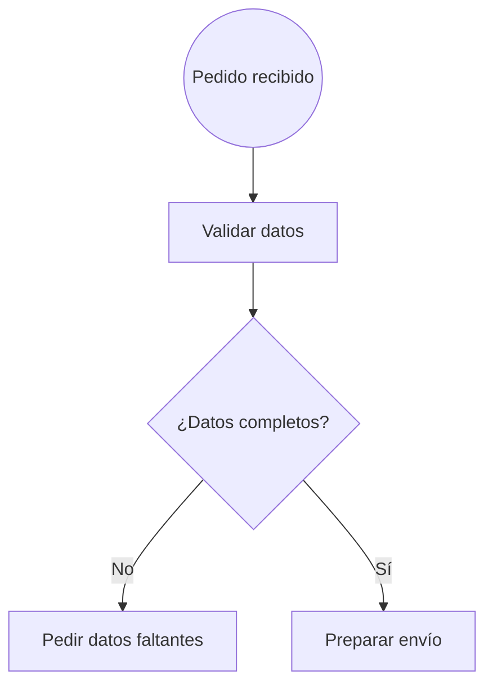
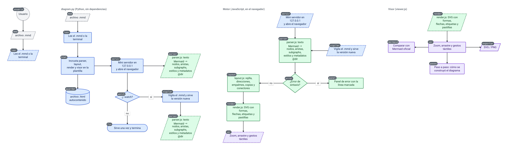

# Diagram Maker

Genera diagramas de flujo a partir de código con sintaxis de **Mermaid (flowchart)** y los muestra en
una página HTML autocontenida, con un motor de layout propio: rejilla ordenada, solo líneas rectas y
sin cruces, y posiciones controlables con metadatos en comentarios.



Este es el propio proyecto, dibujado con él ([`examples/proyecto.mmd`](examples/proyecto.mmd)): cada
`subgraph` se dibuja como un diagrama aparte y las flechas entre ellos usan nodos de referencia
(paralelogramos discontinuos).



Mermaid se usa solo como **sintaxis** (la conocen bien los modelos de IA y el archivo sigue siendo
compatible con Mermaid); el dibujo lo hace este proyecto.

## Uso

Requisitos: Python 3 y un navegador. Sin dependencias.

```sh
python3 diagram.py archivo.mmd             # genera archivo.html junto al .mmd y lo abre
python3 diagram.py archivo.mmd -o x.html   # elige dónde guardar el HTML
python3 diagram.py                         # escribe el diagrama en la terminal (termina con Ctrl+D)
cat archivo.mmd | python3 diagram.py       # también por tubería
python3 diagram.py archivo.mmd --no-open   # solo genera el HTML
python3 diagram.py archivo.mmd --watch     # recarga en vivo: la página se actualiza al guardar
```

El HTML generado es un único archivo: parser, layout y visor van incrustados, así que se puede
abrir o compartir sin nada más. Para abrirlo, el CLI levanta un mini servidor en `127.0.0.1` que
sirve la página una vez (los navegadores en sandbox, como flatpak o snap, no suelen poder abrir
cualquier carpeta). En Android con **Termux** se abre con `termux-open-url`.

Con `--watch` el servidor se queda abierto (Ctrl+C para salir) y vigila el `.mmd`: al guardarlo, la
página se redibuja sola conservando el zoom y la posición; si el código tiene un error se muestra
el panel de error y se sigue vigilando.

## El visor

- **Ratón**: rueda para el zoom, arrastrar para moverse, doble clic para ajustar. Teclado: `+`, `-`, `0`.
- **Táctil**: un dedo arrastra, dos dedos hacen zoom, doble toque ajusta.
- **Pastillas de id**: cada nodo lleva su id en una esquina. Tocar la pastilla de un empalme
  (`● A8`) lleva con una animación hasta ese nodo.
- **Paso a paso** (◀ ▶ arriba a la izquierda, o ← →): muestra cómo se construyó el diagrama, nodo a
  nodo, tal como estaba en cada paso y con el motivo de cada colocación. Sirve para entender o
  depurar el layout.
- **SVG / PNG**: descarga el diagrama.
- **Mermaid**: abre el mismo código dibujado con Mermaid oficial en otra pestaña, para comparar
  (necesita internet).
- Los errores de sintaxis se muestran con el número de línea marcado en el código.

## Sintaxis

Subconjunto de Mermaid flowchart; el detalle está en [`SPEC.md`](SPEC.md).

| Sintaxis | Forma |
|---|---|
| `id["texto"]` | Rectángulo |
| `id("texto")` | Rectángulo redondeado |
| `id(["texto"])` | Estadio |
| `id(("texto"))` | Círculo |
| `id{"texto"}` | Rombo (decisión) |
| `id{{"texto"}}` | Hexágono |
| `id[("texto")]` | Cilindro (base de datos) |
| `id[/"texto"/]`, `id[\"texto"\]` | Paralelogramos |

- **Aristas**: `-->`, `<-->`, `---`, `==>`, `-.->`, con etiqueta `-->|texto|` o `-- texto -->`, y
  cadenas `a --> b --> c`.
- **Subgraphs** (`subgraph ID["Título"] … end`, también anidados): cada uno se dibuja como un
  diagrama aparte, a la derecha del anterior; las flechas entre diagramas usan nodos de referencia.
- **Estilos**: `classDef`, `:::clase`, `class`, `style` y `linkStyle`; el CSS se pasa tal cual al SVG.
- `<br/>` en un texto es un salto de línea.

### Cómo se colocan los nodos

El diagrama crece hacia abajo desde el primer nodo. Las salidas de un nodo van, en orden de
declaración, **abajo, derecha, izquierda** (en un rombo: derecha, izquierda, abajo), así que el
orden en que escribes las aristas ya controla el dibujo. Para el resto, metadatos en comentarios:

```
%% @dir origen -> destino : down|right|left|up
```

Nunca se pisa un nodo ni una línea: si no hay sitio, el layout usa extensiones con empalmes, copia
las hojas lejanas junto a cada padre, pone conectores en vez de líneas largas o desplaza el bloque
mínimo de nodos necesario. Las reglas completas están en [`SPEC.md`](SPEC.md).

## Ejemplos

En [`examples/`](examples): `proyecto.mmd` (el diagrama de arriba), `inicio_app.mmd` (el ejemplo de
la especificación), `prueba_movil.mmd`
y los diagramas `v3_*.mmd`, sacados de un proyecto real (procesos con subgraphs, pines de entrada y
salida, y estilos por proceso).

## Desarrollo

```
diagram.py          CLI: lee el .mmd, incrusta los scripts en la plantilla y abre el navegador
src/parser.js       texto Mermaid -> nodos, aristas, subgraphs, estilos y metadatos
src/layout.js       reglas de colocación -> rejilla -> coordenadas (y la historia del paso a paso)
src/render.js       SVG (formas, flechas, etiquetas, pastillas, sombra)
src/viewer.js       visor: zoom, gestos, paso a paso, exportar
src/template.html   plantilla de la página
tests/              tests con el runner integrado de Node
```

Tests (Node 18 o superior):

```sh
node --test tests/*.test.js
```

- [`SPEC.md`](SPEC.md): especificación y reglas del layout.
- [`PROGRESS.md`](PROGRESS.md): estado del trabajo y cómo retomarlo.
