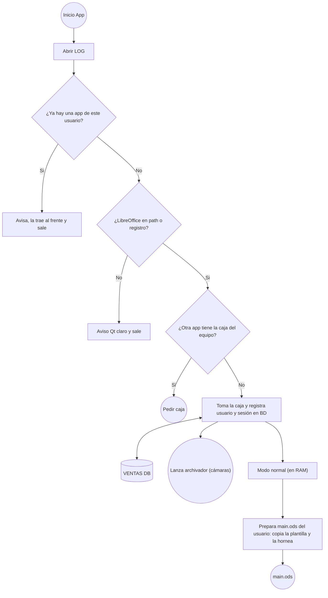

# Diagram Maker — Especificación

Herramienta para sintetizar diagramas a partir de código con sintaxis simple y visualizarlos en una página HTML.

## Objetivo

- Sintaxis de entrada: **subconjunto de Mermaid (flowchart)**, conocida por modelos de IA.
- Motor propio (parser, layout y render): Mermaid solo se usa como sintaxis, no como motor.
- Posicionamiento **completamente automático**, pero controlable mediante metadatos en comentarios.

## Arquitectura

```
diagrama.mmd ──► CLI (Python) ──► genera HTML autocontenido ──► abre navegador
                                   ├─ parser (JS)
                                   ├─ layout (JS)
                                   └─ visor
```

- **CLI en Python, sin dependencias**: recibe un archivo (`python diagram.py archivo.mmd`) o texto introducido en el propio programa, inyecta el código en la plantilla HTML y abre el navegador.
- **Motor en JavaScript**, embebido en el HTML generado (funciona sin servidor).

## Visor web

- El diagrama se muestra centrado al abrir.
- **Scroll**: zoom.
- **Arrastre**: desplazamiento por el lienzo.
- **Descarga** del diagrama como imagen (PNG y SVG).

## Sintaxis soportada

### Formas de nodo

| Sintaxis           | Forma                     |
|--------------------|---------------------------|
| `id["texto"]`      | Rectángulo                |
| `id("texto")`      | Rectángulo redondeado     |
| `id(["texto"])`    | Estadio (píldora)         |
| `id(("texto"))`    | Círculo                   |
| `id{"texto"}`      | Rombo (IF / decisión)     |
| `id[("texto")]`    | Cilindro (base de datos)  |

Convención: IDs descriptivos (`tomaCaja`, `ventasDb`) y textos entre comillas.

### Aristas

| Sintaxis              | Significado                     |
|-----------------------|---------------------------------|
| `a --> b`             | Flecha de `a` a `b`             |
| `a -->\|texto\| b`    | Flecha con etiqueta             |
| `a <--> b`            | Flecha bidireccional            |
| `a --- b`             | Línea sin flecha                |
| `a ==> b`, `a -.-> b` | Flecha gruesa / punteada        |
| `a -- texto --> b`    | Flecha con etiqueta (alternativa) |
| `a --> b --> c`       | Cadena de aristas               |

Las líneas `classDef`, `style`, `class`, `linkStyle` y `click` se ignoran con un aviso.
`subgraph` todavía no está soportado (error).

Las líneas que conectan nodos son **rectas**.

## Reglas de layout por defecto

1. El diagrama crece **hacia abajo** desde el nodo inicial.
2. **Rombo (IF)**: la 1ª salida declarada va a la **derecha**, la 2ª a la **izquierda**.
3. **Cualquier otro nodo**: salidas por orden de declaración:
   1ª → **abajo**, 2ª → **derecha**, 3ª → **izquierda**.
4. Un nodo con **más de 3 salidas** produce un **error fatal**.
5. `a <--> b` cuenta como salida del nodo que la declara (`a`).
6. El orden de declaración de las aristas es en sí mismo una forma de control del layout.
7. **Nodo inicial**: el primer nodo declarado sin aristas entrantes.
8. Las salidas con `@dir` se asignan primero; las demás toman, en orden, las direcciones por defecto que queden libres.
   (Un rombo con 3 salidas usa `down` para la tercera.)
9. Los grupos de nodos desconectados se colocan a la derecha de lo ya dibujado.

### Rejilla

Cada nodo ocupa una celda (columna, fila); un hijo va a la celda vecina de su padre según la dirección.
El ancho de cada columna y el alto de cada fila se ajustan al nodo más grande que contienen, así que
los nodos quedan alineados. El hueco entre celdas crece si la etiqueta de una arista no cabe.

Si dos nodos caen en la misma celda se genera un **aviso** de choque (resolverlo es un TODO).

## Metadatos

Se escriben como comentarios Mermaid (`%%`), por lo que el archivo sigue siendo compatible con Mermaid real.
El prefijo `@` distingue los metadatos de los comentarios normales.

### `@dir` — dirección de una salida

```
%% @dir <origen> -> <destino> : down|right|left|up
```

Sobreescribe la dirección por defecto de la arista `origen -> destino`.
Con `up` y `left` el diagrama puede crecer hacia cualquier dirección.

Si dos salidas de un mismo nodo terminan con la misma dirección → **error fatal**.

## Ejemplo



## TODO

- [ ] Nodos con más de 3 salidas: definir una solución mediante metadatos.
- [ ] Bucles y nodos con varios padres (incluye un nuevo tipo de línea para las aristas que regresan). Decidir tras el prototipo.
- [ ] Choques entre ramas: separación automática. Decidir tras el prototipo.
