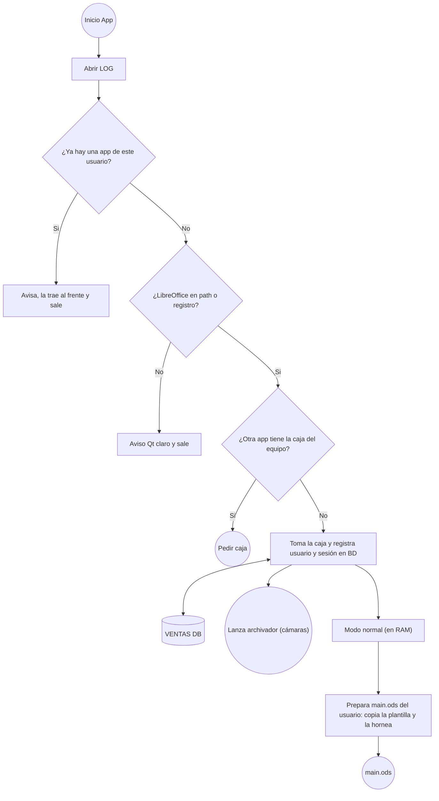

# Diagram Maker — Especificación

Herramienta para sintetizar diagramas a partir de código con sintaxis simple y visualizarlos en una página HTML.

## Objetivo

- Sintaxis de entrada: **subconjunto de Mermaid (flowchart)**, conocida por modelos de IA.
- Motor propio (parser, layout y render): Mermaid solo se usa como sintaxis, no como motor.
- Posicionamiento **completamente automático**, pero controlable mediante metadatos en comentarios.

## Arquitectura

```
diagrama.mmd ──► CLI (Python) ──► genera HTML autocontenido ──► abre navegador
                                   ├─ parser (JS)
                                   ├─ layout (JS)
                                   └─ visor
```

- **Comando `dmk` (Node.js)**: recibe un archivo o texto por la terminal, genera el HTML con el
  código inyectado y lo abre, lo sirve con recarga en vivo (`--watch`) o exporta directamente a
  SVG/PNG con el mismo motor (texto medido y pintado con DejaVu Sans; PNG con resvg en WebAssembly).
  `diagram.py` es la versión anterior, en Python sin dependencias (sin exportación).
- **Motor en JavaScript**, embebido en el HTML generado (funciona sin servidor).
- **Apertura**: el HTML se guarda junto al `.mmd` (o en `-o`) y se abre sirviéndolo **una sola vez**
  desde un mini servidor en 127.0.0.1 (los navegadores en sandbox, como Edge en flatpak, no leen
  cualquier carpeta); en Termux se abre con `termux-open-url`. `--no-open` solo genera el HTML.
- **Recarga en vivo** (`dmk archivo.mmd --watch`): el servidor sigue abierto hasta
  Ctrl+C y vigila el `.mmd` (sondeo del mtime cada 0,5 s). La página servida pregunta cada segundo
  `GET /source?v=N`: `204` si sigue en la versión `N`, o `{"version", "source"}` si el archivo
  cambió, y vuelve a hacer parse → layout → render sin recargar la pestaña (sondeo corto en lugar
  de SSE: es lo más robusto en móvil cuando el navegador congela la pestaña o se corta la conexión;
  con la pestaña oculta no pregunta). `GET /` da la página con el código actual. El HTML guardado
  se regenera en cada cambio, sin recarga en vivo. Requiere archivo de entrada (con stdin, error);
  con `--no-open` sirve igual sin abrir el navegador.

## Visor web

- El diagrama se muestra centrado al abrir.
- **Scroll**: zoom (también `+` / `-`; `0` o doble clic/toque ajusta). La barra no tiene botones de
  zoom: solo muestra el porcentaje.
- **Arrastre**: desplazamiento por el lienzo.
- **Descarga** del diagrama como imagen (PNG y SVG).
- **Mermaid**: abre el mismo código dibujado con Mermaid oficial en otra pestaña, para comparar
  (librería desde jsDelivr: hace falta internet).
- **Táctil**: un dedo arrastra, dos dedos hacen zoom, doble toque ajusta.
- **Pastillas de id**: cada nodo lleva su id en una pastilla en la esquina; siempre visibles, también
  en lo exportado, porque los empalmes y conectores se refieren a los nodos por su id. La pastilla
  se ancla al contorno real de la forma (en rombos y círculos, centrada en su lado superior
  izquierdo).
- **Tocar la pastilla de un empalme o conector** desplaza la vista, con una animación, hasta su
  nodo dueño (el original si hay copias), que parpadea un momento.
- **Paso a paso** (depuración del layout): ◀ ▶ arriba a la izquierda (o ← →, Inicio, Fin) muestran
  los nodos en el orden en que el layout los colocó, con el motivo de cada colocación; el nodo del
  paso actual se resalta y, si queda fuera de la pantalla, la vista se centra en él. Cada paso se
  dibuja **tal como estaba el diagrama al terminarlo**: una inserción de fila o columna, un hermano
  movido o una línea alargada aparecen en el paso que los provocó, no antes.
- **Recarga en vivo** (con `--watch`): un indicador «● en vivo» / «○ sin conexión» en la barra.
  Al llegar código nuevo se **conserva la vista** (zoom y desplazamiento, sin re-ajustar; el primer
  nodo colocado se queda en el mismo punto de la pantalla aunque el diagrama crezca por arriba o
  por la izquierda) y, si se estaba en el paso a paso, se vuelve al diagrama completo (con otro
  código cambian el orden y el número de pasos). Un error muestra el panel de error y se sigue
  vigilando: al corregirlo desaparece y vuelve el diagrama. Los avisos se actualizan.

## Sintaxis soportada

### Formas de nodo

| Sintaxis           | Forma                     |
|--------------------|---------------------------|
| `id["texto"]`      | Rectángulo                |
| `id("texto")`      | Rectángulo redondeado     |
| `id(["texto"])`    | Estadio (píldora)         |
| `id[/"texto"/]`    | Paralelogramo inclinado a la derecha |
| `id[\"texto"\]`    | Paralelogramo inclinado a la izquierda |
| `id(("texto"))`    | Círculo                   |
| `id{"texto"}`      | Rombo (IF / decisión)     |
| `id{{"texto"}}`    | Hexágono                  |
| `id[["texto"]]`    | Subrutina                 |
| `id[("texto")]`    | Cilindro (base de datos)  |

Convención: IDs descriptivos (`tomaCaja`, `ventasDb`) y textos entre comillas.

### Aristas

| Sintaxis              | Significado                     |
|-----------------------|---------------------------------|
| `a --> b`             | Flecha de `a` a `b`             |
| `a -->\|texto\| b`    | Flecha con etiqueta             |
| `a <--> b`            | Flecha bidireccional            |
| `a --- b`             | Línea sin flecha                |
| `a ==> b`, `a -.-> b` | Flecha gruesa / punteada        |
| `a -- texto --> b`    | Flecha con etiqueta (alternativa) |
| `a --> b --> c`       | Cadena de aristas               |

Las líneas `classDef`, `style`, `class`, `linkStyle` y `click` se ignoran con un aviso.
`subgraph` todavía no está soportado (error).

Las líneas que conectan nodos son **rectas**.

### Subgraphs

```
subgraph ID["Título"]      (también: subgraph ID[Título], subgraph "Título", subgraph Título)
    ...
end
```

- **Cada subgraph es un diagrama aparte.** No se dibujan rectángulos: el nivel superior va primero y
  cada subgraph (hijos directos y anidados, en orden de aparición) va a la derecha del anterior,
  con su propio layout. Ningún diagrama invade el área de otro.
- **Título:** un label encima de cada diagrama. En los anidados incluye la ruta: `APP › Ventas`.
- **Pertenencia:** un nodo pertenece al subgraph donde aparece por primera vez (declarado o en una arista).
- **Aristas entre diagramas:** se dibujan en los dos. En cada uno, el extremo ajeno se sustituye por
  un **nodo de referencia**: paralelogramo con borde discontinuo y el texto del nodo real. Hay una
  referencia por arista. La copia conserva etiqueta, estilo y `@dir`.
- **Colocación de las referencias entrantes** (la referencia apunta a un nodo del diagrama): se
  dibujan pegadas a su nodo destino, no sueltas.
  - Si el nodo no tiene padre real en su diagrama, su primera referencia entrante hace de padre y va
    **arriba** (así `iArr --> S1 --> S2` sigue bajando).
  - Si no, cuenta como una salida más del nodo: todas sus conexiones (salidas reales y referencias
    entrantes) toman abajo, derecha, izquierda (rombo: derecha, izquierda, abajo) **en el orden de
    declaración de las aristas**.
  - Una referencia nunca quita el hueco a una salida real: si no cabe, prueba cualquier lado libre y,
    si no queda ninguno, se dibuja suelta.
- **Nodo cuyas únicas entradas son referencias** (p. ej. `iApi --> S7 --> S4` con S4 ya colocado):
  cuenta como nodo sin padre, así que se aplica la regla 9: se pega a su primer hijo ya colocado y
  su referencia entrante pasa a ser una salida más. Si ningún hijo está colocado o no hay lados
  libres, empieza un grupo nuevo.
  - Con `@dir`, la dirección es la de la flecha (`%% @dir iOds -> S2 : left` → S2 queda a la izquierda
    de la referencia, es decir, la referencia a la derecha de S2).
- **Nodos absorbidos:** un nodo de fuera de todo subgraph cuyas aristas van **todas** a nodos de
  subgraphs no se dibuja en su diagrama (ni sus referencias): aparece solo dentro de esos subgraphs,
  con su forma y borde normales, porque no es referencia a nada dibujado en otro sitio. Se dibuja
  **una sola vez por diagrama**: con una sola arista ahí se pega a su destino como una referencia;
  con varias es un nodo normal (si tiene más de 4 conexiones usa empalmes, como cualquier nodo).
  TODO: decidir si un nodo absorbido muy compartido debería volver a una copia por arista.
  Un nodo sin aristas, o con alguna arista a un nodo de fuera o a un subgraph entero,
  no se absorbe. Un diagrama que se queda sin nodos no se dibuja.
- **Arista hacia o desde un subgraph entero** (`a --> APP`): solo se dibuja en el diagrama del nodo,
  con una referencia que lleva el título del subgraph. Entre dos subgraphs enteros se ignora con aviso.
- `direction` dentro de un subgraph se ignora con aviso; `style` de un subgraph, como todos los estilos.

### Estilos

Sintaxis de Mermaid: `classDef nombre props`, `id:::nombre`, `class id1,id2 nombre`,
`style id props` y `linkStyle 0,2|default props`. Las propiedades son CSS (`fill:#dcfce7,stroke:#15803d`).

- **Se pasan tal cual al SVG** como `style="…"`, sin lista de propiedades permitidas: cualquier
  propiedad que el navegador entienda en SVG funciona.
- En un nodo, la forma recibe todo menos lo de texto; el texto recibe `font-*`, `letter-*`,
  `word-*`, `text-*` y `color` (que en SVG se traduce a `fill` del texto, como hace Mermaid);
  `opacity` va al nodo entero. En una flecha, `color` y las de fuente van a su etiqueta; cada
  color de línea tiene su propia punta de flecha.
- `font-size`, `font-family`, `font-weight`, `font-style` y `letter-spacing` se usan también para
  **medir** el texto, así el nodo crece con la fuente.
- Prioridad (como Mermaid): `classDef default` → clases del nodo (gana la definida más tarde) →
  `style` del nodo.
- Referencias y nodos absorbidos llevan el estilo del nodo real; las referencias conservan el borde
  discontinuo.
- Avisos: propiedades de HTML sin efecto en SVG (`background`, `padding`, `margin`, `border`…),
  clase sin `classDef`, `linkStyle` con un número de flecha que no existe, `click`, y estilos de un
  subgraph (se ignoran de momento: no hay caja).

## Reglas de layout por defecto

1. El diagrama crece **hacia abajo** desde el nodo inicial.
2. **Rombo (IF)**: la 1ª salida declarada va a la **derecha**, la 2ª a la **izquierda**.
3. **Cualquier otro nodo**: salidas por orden de declaración:
   1ª → **abajo**, 2ª → **derecha**, 3ª → **izquierda**.
4. **Más de 4 conexiones** (padres + hijos, contando las referencias de su diagrama): un nodo solo
   tiene 4 lados, así que conserva las 3 primeras en orden de declaración y la 4ª es una
   **extensión**: una línea sin flecha hasta un **empalme**, del que salen las demás. Un empalme se
   dibuja como una **pastilla con el id de su dueño** (`● A8`) y ocupa ese tamaño en la rejilla.
   El empalme tiene 3 lados libres; si no le bastan, se queda con 2 y encadena otro empalme. Un
   empalme solo lo coloca su dueño, por su extensión: una rama que llega a él espera a que esté. Las
   ramas conservan su flecha y su etiqueta (si la flecha entraba al nodo, termina en el empalme) y
   un `@dir` de una conexión movida pasa a su rama. Con 4 salidas y sin padre, la 4ª va arriba.
5. `a <--> b` cuenta como salida del nodo que la declara (`a`).
6. El orden de declaración de las aristas es en sí mismo una forma de control del layout.
7. **Nodo inicial**: el primer nodo declarado sin aristas entrantes.
8. Las salidas con `@dir` se asignan primero; las demás toman, en orden, las direcciones por defecto que queden libres.
   (Un rombo con 3 salidas usa `down` para la tercera.)
9. Los grupos de nodos desconectados se colocan a la derecha de lo ya dibujado. Un nodo sin padre
   (que no es el inicial) con algún hijo ya colocado no está desconectado: se pega al primero de
   esos hijos, en orden de declaración, en su primer lado libre (abajo, derecha, izquierda, arriba;
   `@dir` en esa arista lo elige). El hijo hace de padre sin cambiar el sentido de la flecha.
   Si todavía no tiene ningún hijo colocado, se aplaza y se reintenta cuando los demás grupos ya
   están colocados. Si aun así no puede, el grupo entero se **reconstruye desde su conexión** con
   lo ya colocado: el nodo del grupo que tiene esa conexión va junto a su pareja y el resto del
   grupo se recorre desde ahí siguiendo las aristas en cualquier sentido (las flechas no cambian),
   cada nodo en el primer lado libre del anterior. Con `a->b->c` colocado, `A->B->C` y `C->c`
   queda `a,b,c,C,B,A`. Se usa la primera conexión, en orden de declaración, con la que el grupo
   cabe sin pisar ningún nodo; un nodo del grupo que no tiene ningún lado libre no se fuerza: se
   deja fuera y se coloca después por el recorrido normal, con la cascada de la regla 10. Si no
   cabe con ninguna, se vuelve a la primera conexión y se
   **extiende** la línea de su pareja hasta un empalme (como en la regla 4), que da 3 lados libres
   para el grupo; la extensión puede cruzar celdas vacías en línea recta (hasta 8) hasta donde el
   grupo quepa. Si la pareja no tiene ningún lado libre, se prueba con la siguiente conexión. Solo
   un grupo sin ninguna conexión con lo colocado empieza aparte.

10. **Nunca se pisa un nodo ni una línea.** Una celda está ocupada si tiene un nodo, si está
    reservada para otro hijo o si la atraviesa una flecha recta ya trazada. Si la celda que le toca
    a un nodo está ocupada, se aplica una cascada **finita**, de lo más local a lo más global:
    1. Otro lado libre del padre que no esté reservado para otra conexión (abajo, derecha,
       izquierda, arriba).
    2. **Extensión** en línea recta hasta un empalme, por el lado de un hermano (que aún no esté
       colocado, o que sea una hoja con una sola conexión, que se puede mover) o por un lado libre.
       El empalme va a 1, 2… hasta 8 celdas, por celdas libres, en la primera posición donde quepan
       el hermano y el nodo: el hermano sigue recto si puede (si no, a otro lado libre del
       empalme) y el nodo va a un lado libre.
    3. Si ninguna dirección sirve: se **hace sitio desplazando una celda el mínimo bloque de
       nodos**: los que ocupan las celdas necesarias, los que estos empujan en cadena, los unidos
       a un nodo movido por una flecha perpendicular al desplazamiento (para que no quede en
       diagonal) y los extremos de las líneas sobre las que caería un nodo movido. Las flechas
       paralelas solo se alargan. Cada plan se comprueba con las posiciones finales (una flecha que
       se alarga sobre la celda que deja un nodo movido también cuenta). Gana el lado que mueve
       menos nodos. Si una flecha del padre ya
       salía hacia ese lado, la celda liberada es un empalme por el que sigue recta y el nodo va a
       un lado del empalme. Si ningún bloque sirve sin mover al propio padre, se desplaza todo lo
       que queda más allá (una fila o columna entera). Este paso siempre funciona.
    Una dirección pedida con `@dir` también puede moverse así (con un aviso: es una preferencia).
11. Si un nodo recibe más referencias de las que caben en sus lados, las que sobran se dibujan
    sueltas a la derecha, al final, y nunca hacen de padre.
12. **Copias de hojas:** cuando un padre, en su turno, tiene como hijo una hoja (nodo sin hijos)
    ya colocada lejos (no en una celda vecina), se le pone una **copia** de la hoja como un hijo
    más, en el lado que le tocaba a esa flecha o en el primero libre; así no hay líneas largas
    cruzando el diagrama (si el padre no tiene sitio, se hace con la cascada de la regla 10). Si
    la flecha va a un **empalme** lejano, se copia el empalme (la pastilla `● dueño`), tenga o no hijos su dueño; si el dueño es una hoja se copia el
    nodo completo. Una extensión hacia un empalme propio nunca se copia, y un nodo cuenta como
    hoja solo si ni él ni sus empalmes tienen salidas. Al final, una pasada de respaldo hace lo
    mismo con las flechas que no pasaron por el recorrido. La copia es idéntica (forma, estilo, id). Una flecha hacia un empalme de una hoja
    cuenta como flecha hacia la hoja, y un empalme que se queda sin ramas se quita. Si el padre no
    tiene ningún lado libre, se queda la línea larga.
13. **Conectores:** al terminar, una flecha que haya quedado en diagonal o pasando por encima de un
    nodo (típicamente la del segundo padre de un nodo con hijos, colocado junto al primero)
    termina en una **pastilla junto a su origen** con el id de su destino (`● F3`), como una copia
    de empalme; si el origen no tiene sitio, se usa la cascada de la regla 10. En el paso a
    paso, una flecha provisional que luego se reconduce no se dibuja mientras esté en diagonal o
    sobre un nodo.
14. **Reutilizar al lado:** si un nodo necesita una referencia, una copia o un conector de X y ya
    tiene **pegado** (o reservado a su lado) un representante de X —una referencia, una copia o el
    propio X; para un empalme, cualquier pastilla de su dueño—, la flecha va a ese en vez de crear
    otro.
    El original también cuenta: si el padre ya tiene pegado el nodo original, no se crea copia.
15. **Limpieza final:** se quitan los autogenerados que han quedado de sobra: una copia, referencia
    o conector con una sola flecha cuyo otro extremo tiene ya pegado otro representante del mismo
    nodo (la flecha va a ese), y un empalme que solo conserva una rama alineada con su dueño (la
    flecha va recta al dueño).

### Rejilla

Los nodos se colocan **en profundidad**, en orden de declaración: cada nodo termina toda su rama
antes de pasar a su siguiente hermano. Al expandir un nodo se **reservan las celdas** de todos sus
hijos antes de bajar por ninguna rama, para que un descendiente de un hermano anterior no se las
quite (una extensión sí puede usar la celda de un hermano, que sigue recto desde el empalme). Es también el orden del
modo paso a paso del visor.

Cada nodo ocupa una celda (columna, fila); un hijo va a la celda vecina de su padre según la dirección.
El ancho de cada columna y el alto de cada fila se ajustan al nodo más grande que contienen, así que
los nodos quedan alineados. El hueco entre celdas crece si la etiqueta de una arista no cabe.

Dos nodos nunca deberían compartir celda (regla 10); si aun así ocurre, se genera un **aviso** de
choque (los tests aleatorios lo vigilan).

## Metadatos

Se escriben como comentarios Mermaid (`%%`), por lo que el archivo sigue siendo compatible con Mermaid real.
El prefijo `@` distingue los metadatos de los comentarios normales.

### `@dir` — dirección de una salida

```
%% @dir <origen> -> <destino> : down|right|left|up
```

Indica la dirección preferida de la arista `origen -> destino`. Es una **preferencia**: se respeta
siempre que ese lado esté libre; si otra conexión del nodo ya pedía ese lado o la celda está
ocupada, la arista se coloca como cualquier otra (con la cascada de la regla 10) y se avisa:
`@dir a -> b : left no se pudo respetar (…)`. Nunca produce un error ni un choque.

Si dos `@dir` de un mismo nodo piden el mismo lado, se respeta el primero y el segundo se avisa.

## Ejemplo



## TODO

- [ ] Estilos de un subgraph (`style ID …`): hoy se ignoran con aviso. Decidir si se aplican al
      título o como fondo del área de su diagrama.
- [x] Nodos con más de 3 salidas / 4 conexiones: empalmes automáticos (regla 4). Pendiente: `@bus`
      para elegir a mano qué conexiones comparten empalme.
- [x] Bucles y nodos con varios padres: copias de hojas (regla 12), conectores (regla 13) y
      reutilizar representantes al lado (regla 14); no hace falta un tipo de línea nuevo.
- [x] Choques entre ramas: cascada para hacer sitio (regla 10) y grupos reconstruidos (regla 9).
- [ ] Rotar subárboles ya colocados ("engranajes") para evitar empalmes, como pasada final.
- [ ] Diagramas con muchos subgraphs: hoy van todos en una fila (quedan muy anchos).
- [ ] `flowchart LR` / `direction`: hoy se ignoran (el layout usa sus propias reglas).
