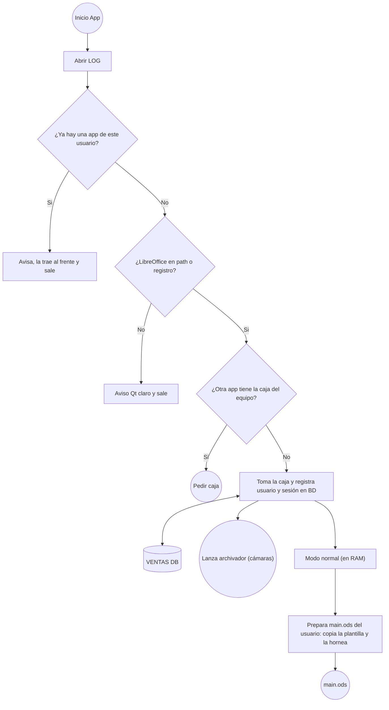

# Diagram Maker — Especificación

Herramienta para sintetizar diagramas a partir de código con sintaxis simple y visualizarlos en una página HTML.

## Objetivo

- Sintaxis de entrada: **subconjunto de Mermaid (flowchart)**, conocida por modelos de IA.
- Motor propio (parser, layout y render): Mermaid solo se usa como sintaxis, no como motor.
- Posicionamiento **completamente automático**, pero controlable mediante metadatos en comentarios.

## Arquitectura

```
diagrama.mmd ──► CLI (Python) ──► genera HTML autocontenido ──► abre navegador
                                   ├─ parser (JS)
                                   ├─ layout (JS)
                                   └─ visor
```

- **CLI en Python, sin dependencias**: recibe un archivo (`python diagram.py archivo.mmd`) o texto introducido en el propio programa, inyecta el código en la plantilla HTML y abre el navegador.
- **Motor en JavaScript**, embebido en el HTML generado (funciona sin servidor).

## Visor web

- El diagrama se muestra centrado al abrir.
- **Scroll**: zoom.
- **Arrastre**: desplazamiento por el lienzo.
- **Descarga** del diagrama como imagen (PNG y SVG).

## Sintaxis soportada

### Formas de nodo

| Sintaxis           | Forma                     |
|--------------------|---------------------------|
| `id["texto"]`      | Rectángulo                |
| `id("texto")`      | Rectángulo redondeado     |
| `id(["texto"])`    | Estadio (píldora)         |
| `id[/"texto"/]`    | Paralelogramo inclinado a la derecha |
| `id[\"texto"\]`    | Paralelogramo inclinado a la izquierda |
| `id(("texto"))`    | Círculo                   |
| `id{"texto"}`      | Rombo (IF / decisión)     |
| `id{{"texto"}}`    | Hexágono                  |
| `id[("texto")]`    | Cilindro (base de datos)  |

Convención: IDs descriptivos (`tomaCaja`, `ventasDb`) y textos entre comillas.

### Aristas

| Sintaxis              | Significado                     |
|-----------------------|---------------------------------|
| `a --> b`             | Flecha de `a` a `b`             |
| `a -->\|texto\| b`    | Flecha con etiqueta             |
| `a <--> b`            | Flecha bidireccional            |
| `a --- b`             | Línea sin flecha                |
| `a ==> b`, `a -.-> b` | Flecha gruesa / punteada        |
| `a -- texto --> b`    | Flecha con etiqueta (alternativa) |
| `a --> b --> c`       | Cadena de aristas               |

Las líneas `classDef`, `style`, `class`, `linkStyle` y `click` se ignoran con un aviso.
`subgraph` todavía no está soportado (error).

Las líneas que conectan nodos son **rectas**.

### Subgraphs

```
subgraph ID["Título"]      (también: subgraph ID[Título], subgraph "Título", subgraph Título)
    ...
end
```

- **Cada subgraph es un diagrama aparte.** No se dibujan rectángulos: el nivel superior va primero y
  cada subgraph (hijos directos y anidados, en orden de aparición) va a la derecha del anterior,
  con su propio layout. Ningún diagrama invade el área de otro.
- **Título:** un label encima de cada diagrama. En los anidados incluye la ruta: `APP › Ventas`.
- **Pertenencia:** un nodo pertenece al subgraph donde aparece por primera vez (declarado o en una arista).
- **Aristas entre diagramas:** se dibujan en los dos. En cada uno, el extremo ajeno se sustituye por
  un **nodo de referencia**: paralelogramo con borde discontinuo y el texto del nodo real. Hay una
  referencia por arista. La copia conserva etiqueta, estilo y `@dir`.
- **Colocación de las referencias entrantes** (la referencia apunta a un nodo del diagrama): se
  dibujan pegadas a su nodo destino, no sueltas.
  - Si el nodo no tiene padre real en su diagrama, su primera referencia entrante hace de padre y va
    **arriba** (así `iArr --> S1 --> S2` sigue bajando).
  - Si no, cuenta como una salida más del nodo: todas sus conexiones (salidas reales y referencias
    entrantes) toman abajo, derecha, izquierda (rombo: derecha, izquierda, abajo) **en el orden de
    declaración de las aristas**.
  - Una referencia nunca quita el hueco a una salida real: si no cabe, prueba cualquier lado libre y,
    si no queda ninguno, se dibuja suelta.
- **Nodo cuyas únicas entradas son referencias** (p. ej. `iApi --> S7 --> S4` con S4 ya colocado):
  cuenta como nodo sin padre, así que se aplica la regla 9: se pega a su primer hijo ya colocado y
  su referencia entrante pasa a ser una salida más. Si ningún hijo está colocado o no hay lados
  libres, empieza un grupo nuevo.
  - Con `@dir`, la dirección es la de la flecha (`%% @dir iOds -> S2 : left` → S2 queda a la izquierda
    de la referencia, es decir, la referencia a la derecha de S2).
- **Nodos absorbidos:** un nodo de fuera de todo subgraph cuyas aristas van **todas** a nodos de
  subgraphs no se dibuja en su diagrama (ni sus referencias): aparece solo dentro de esos subgraphs,
  con su forma y borde normales, porque no es referencia a nada dibujado en otro sitio. Se dibuja
  **una sola vez por diagrama**: con una sola arista ahí se pega a su destino como una referencia;
  con varias es un nodo normal (si tiene más de 4 conexiones usa empalmes, como cualquier nodo).
  TODO: decidir si un nodo absorbido muy compartido debería volver a una copia por arista.
  Un nodo sin aristas, o con alguna arista a un nodo de fuera o a un subgraph entero,
  no se absorbe. Un diagrama que se queda sin nodos no se dibuja.
- **Arista hacia o desde un subgraph entero** (`a --> APP`): solo se dibuja en el diagrama del nodo,
  con una referencia que lleva el título del subgraph. Entre dos subgraphs enteros se ignora con aviso.
- `direction` dentro de un subgraph se ignora con aviso; `style` de un subgraph, como todos los estilos.

### Estilos

Sintaxis de Mermaid: `classDef nombre props`, `id:::nombre`, `class id1,id2 nombre`,
`style id props` y `linkStyle 0,2|default props`. Las propiedades son CSS (`fill:#dcfce7,stroke:#15803d`).

- **Se pasan tal cual al SVG** como `style="…"`, sin lista de propiedades permitidas: cualquier
  propiedad que el navegador entienda en SVG funciona.
- En un nodo, la forma recibe todo menos lo de texto; el texto recibe `font-*`, `letter-*`,
  `word-*`, `text-*` y `color` (que en SVG se traduce a `fill` del texto, como hace Mermaid);
  `opacity` va al nodo entero. En una flecha, `color` y las de fuente van a su etiqueta; cada
  color de línea tiene su propia punta de flecha.
- `font-size`, `font-family`, `font-weight`, `font-style` y `letter-spacing` se usan también para
  **medir** el texto, así el nodo crece con la fuente.
- Prioridad (como Mermaid): `classDef default` → clases del nodo (gana la definida más tarde) →
  `style` del nodo.
- Referencias y nodos absorbidos llevan el estilo del nodo real; las referencias conservan el borde
  discontinuo.
- Avisos: propiedades de HTML sin efecto en SVG (`background`, `padding`, `margin`, `border`…),
  clase sin `classDef`, `linkStyle` con un número de flecha que no existe, `click`, y estilos de un
  subgraph (se ignoran de momento: no hay caja).

## Reglas de layout por defecto

1. El diagrama crece **hacia abajo** desde el nodo inicial.
2. **Rombo (IF)**: la 1ª salida declarada va a la **derecha**, la 2ª a la **izquierda**.
3. **Cualquier otro nodo**: salidas por orden de declaración:
   1ª → **abajo**, 2ª → **derecha**, 3ª → **izquierda**.
4. **Más de 4 conexiones** (padres + hijos, contando las referencias de su diagrama): un nodo solo
   tiene 4 lados, así que conserva las 3 primeras en orden de declaración y la 4ª es una
   **extensión**: una línea sin flecha hasta un **empalme** (un punto), del que salen las demás.
   El empalme tiene 3 lados libres; si no le bastan, se queda con 2 y encadena otro empalme. Las
   ramas conservan su flecha y su etiqueta (si la flecha entraba al nodo, termina en el empalme) y
   un `@dir` de una conexión movida pasa a su rama. Con 4 salidas y sin padre, la 4ª va arriba.
5. `a <--> b` cuenta como salida del nodo que la declara (`a`).
6. El orden de declaración de las aristas es en sí mismo una forma de control del layout.
7. **Nodo inicial**: el primer nodo declarado sin aristas entrantes.
8. Las salidas con `@dir` se asignan primero; las demás toman, en orden, las direcciones por defecto que queden libres.
   (Un rombo con 3 salidas usa `down` para la tercera.)
9. Los grupos de nodos desconectados se colocan a la derecha de lo ya dibujado. Un nodo sin padre
   (que no es el inicial) con algún hijo ya colocado no está desconectado: se pega al primero de
   esos hijos, en orden de declaración, en su primer lado libre (abajo, derecha, izquierda, arriba;
   `@dir` en esa arista lo elige). El hijo hace de padre sin cambiar el sentido de la flecha.

10. Si al colocar un hijo (o una referencia) su celda ya está ocupada, se prueba otro lado del padre
    que no esté reservado para otra de sus conexiones y cuya celda esté libre, en el orden abajo,
    derecha, izquierda, arriba. Una dirección fijada con `@dir` no se mueve. Si no hay ninguno libre,
    queda el aviso de choque.
11. Si un nodo recibe más referencias de las que caben en sus lados, las que sobran se dibujan
    sueltas a la derecha, al final, y nunca hacen de padre.

### Rejilla

Cada nodo ocupa una celda (columna, fila); un hijo va a la celda vecina de su padre según la dirección.
El ancho de cada columna y el alto de cada fila se ajustan al nodo más grande que contienen, así que
los nodos quedan alineados. El hueco entre celdas crece si la etiqueta de una arista no cabe.

Si dos nodos caen en la misma celda se genera un **aviso** de choque (resolverlo es un TODO).

## Metadatos

Se escriben como comentarios Mermaid (`%%`), por lo que el archivo sigue siendo compatible con Mermaid real.
El prefijo `@` distingue los metadatos de los comentarios normales.

### `@dir` — dirección de una salida

```
%% @dir <origen> -> <destino> : down|right|left|up
```

Sobreescribe la dirección por defecto de la arista `origen -> destino`.
Con `up` y `left` el diagrama puede crecer hacia cualquier dirección.

Si dos salidas de un mismo nodo terminan con la misma dirección → **error fatal**.

## Ejemplo



## TODO

- [ ] Estilos de un subgraph (`style ID …`): hoy se ignoran con aviso. Decidir si se aplican al
      título o como fondo del área de su diagrama.
- [x] Nodos con más de 3 salidas / 4 conexiones: empalmes automáticos (regla 4). Pendiente: `@bus`
      para elegir a mano qué conexiones comparten empalme.
- [ ] Bucles y nodos con varios padres (incluye un nuevo tipo de línea para las aristas que regresan). Decidir tras el prototipo.
- [ ] Choques entre ramas: separación automática. Decidir tras el prototipo.
